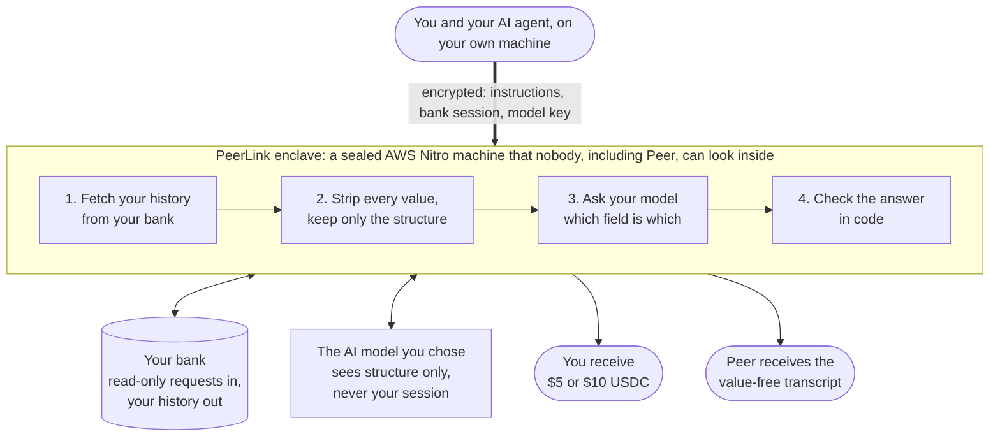
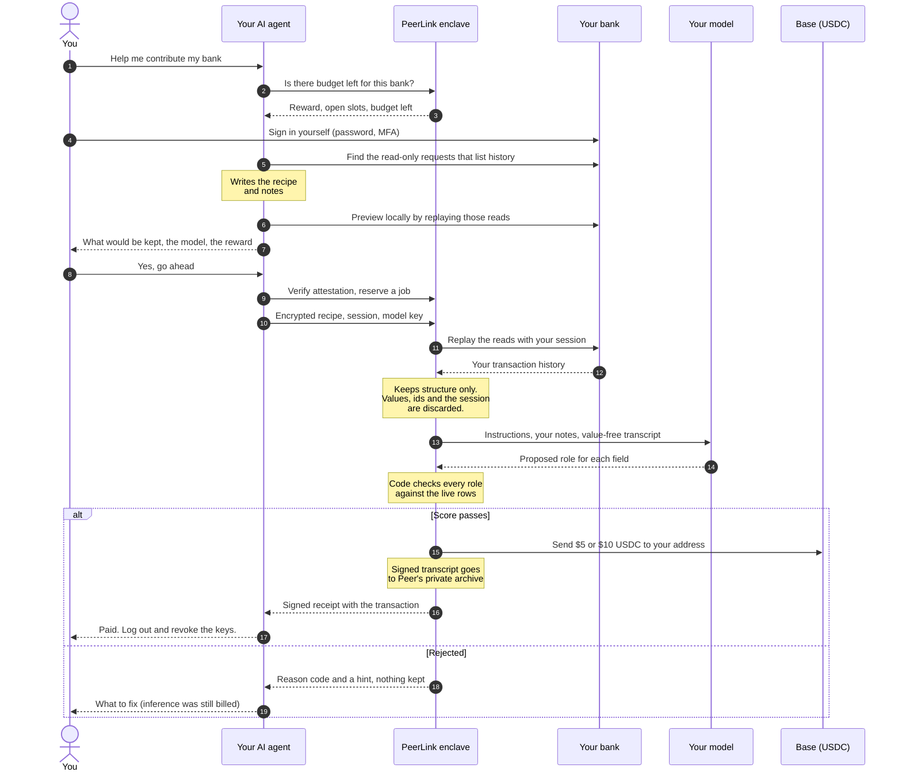

# PeerLink

**Contribute your bank. Earn USDC for useful evidence.**

PeerLink collects banking transcripts from account owners. Your local agent
finds the read-only requests your bank's own site uses to show transaction
history. An attested AWS Nitro enclave replays them with your session, keeps a
value-free transcript of the request and response structure, and pays a fixed
$5 or $10 USDC on Base when the transcript is useful. Peer engineers turn
accepted transcripts into Curator metadata and attestation transformers. You do
not write a provider or open a pull request.

[Website](https://link.peer.xyz) · [Contribution skill](skills/contribute-transcript/SKILL.md) ·
[Recipe guide](docs/transcript-recipes.md) · [Campaign issues](https://github.com/zkp2p/peer-link/issues/64) ·
[Rewards](docs/incentives.md) · [Privacy](docs/privacy.md) ·
[Developer docs](https://docs.peer.xyz/developer/peer-link)

## Start with your local agent

> Read AGENTS.md and skills/contribute-transcript/SKILL.md in
> https://github.com/zkp2p/peer-link and help me contribute a read-only
> transcript of my bank's transaction history. Check live capacity for my bank
> first. I will sign in myself; never start a payment or change a setting.
> Preview what will be kept, and show me the model my API key will pay for,
> before you send anything. Keep credentials and bank data out of chat, Git and
> logs.

## How it works

### At a glance



| Who | What they see |
| --- | --- |
| You and your agent | Everything. It is your account, on your machine. |
| The PeerLink enclave | Your bank session and raw history, in memory, for one job. Both are discarded when the job ends. |
| The AI model you chose | Your agent's notes and the value-free transcript: field names, types and formats. Never your session, ids, names or amounts. |
| Peer engineers | The same notes and value-free transcript, signed, and only if the job is accepted. |
| Peer's servers outside the enclave | Encrypted data they cannot open, plus public job status. |

### Step by step



Nothing about your account is sent until step 10; before that your agent only
asks the service whether there is capacity. Steps 11 to 16 happen inside the
enclave, usually in under a minute.

### In detail

1. **Pick a campaign.** Twenty banks have an `open_recipe` campaign in which the
   contributor's agent supplies the read route. Mercury has a
   `reviewed_descriptor` campaign with a fixed API route. After
   `npm run transcripts:setup`, run
   `.local/transcript-venv/bin/python -m transcripts.cli campaigns --live` to
   see them with remaining capacity.
2. **Write a recipe.** The agent records up to six GET or read-only POST
   requests on the bank's domain, a selector for a stable account id, a
   selector for the transaction list, and notes for engineers.
3. **Preview.** `preview` runs the reads from the contributor's own machine and
   prints exactly what would be kept, so the owner can review it before
   anything leaves.
4. **Verify and encrypt.** The client checks the enclave's Nitro attestation
   against the measurements pinned in [`transcripts/release.json`](transcripts/release.json),
   reserves a job, and encrypts the recipe, the bank session and the owner's
   inference key to the attested key.
5. **Acquire and redact.** The enclave confirms the reads are not served
   without a session, replays them over TLS that ends inside the enclave, and
   derives the transcript: path templates, query names, credential header
   names, response field paths with types and format classes, and tokens under
   status-like keys. Values, ids, cookies and tokens are discarded.
6. **Ask the owner's model.** The enclave builds one prompt: PeerLink's
   instructions, then the contributor's notes and the transcript, then
   PeerLink's output contract. It sends that once to the OpenAI-compatible
   endpoint and model the owner chose, on the owner's key. The model proposes
   which field is the payment id, amount, timestamp, counterparty, currency and
   status.
7. **Check in code and pay.** Code tests every proposed field against the live
   records and computes the score itself. A passing transcript is signed and
   archived on the enclave host, mirrored to Peer's private S3 bucket, and the
   reward is sent at once; the contributor receives a signed receipt with the
   Base transaction.

Two properties are deliberate. The bank session is used by the enclave to make
the reads and is never placed in a prompt, so no model provider sees it. And
because the score comes from code checking the records, not from the model, any
inference endpoint can be allowed without letting a model award a reward.

## Campaigns, rewards and costs

- Each accepted contribution earns the campaign's fixed **$5 or $10 USDC**; one
  paid contribution per bank account per campaign.
- All campaigns share one funded budget of at most **$50** per release epoch
  with no automatic refill. `campaigns` prints the amount funded for the
  current release as `epochBudgetUSDC` (`pilotBudgetMinor` in the measured
  [policy](transcripts/policy.json)), and `campaigns --live` shows what is
  left. A successful reservation, valid for ten minutes, is
  what admits a job. A listing is not a promise of capacity.
- **The contributor pays for inference**, one call per job, including when the
  job is rejected. Peer pays infrastructure, gas and rewards.
- **Mercury** is first-contributor source validation: one accepted organization,
  $10, through a read-only API token. Its first positive live acquisition is
  still pending. See [source validation](docs/source-validation.md).
- **Wise** is already integrated in Peer and has no public reward. Peer used
  it to test the open-recipe flow end to end on a separate validation release.

Terms are in [docs/incentives.md](docs/incentives.md).

## Limits to know

- Field names and status tokens are kept by heuristic rules; review the
  `preview` output before contributing.
- The enclave refuses POST requests that are obviously named as state changes,
  but it cannot prove a request is read-only. Replay only what the bank's site
  issues while viewing history.
- The chosen model provider sees the notes and the value-free transcript.
- For open campaigns the account identity used for deduplication is declared by
  the contributor's recipe.
- Rewards are paid from an AWS KMS key that Peer's operators can also use and
  recover. It is not an escrow, and the enclave is not the key's only user.
- A paid transcript does not add a bank to Peer or prove any payment.

## Develop and inspect

Node 20.19+, npm, Python 3.11+ and OpenSSL. Credential-free checks need no bank
account or inference key.

```sh
npm ci --ignore-scripts
npm run check:bank
npm run verify:setup
npm run check
npm run transcripts:setup
npm run transcripts:test
npm run dev
```

`transcripts/` holds the service, client and CLI. `transcripts/open_source.py`
implements open recipes, redaction and the mapping check. `app/` is the landing
page. `banks/`, `lib/` and `verification/` are reference assets from the
earlier program.

[Product and architecture](docs/transcript-contributions-prd.md) ·
[Operations](docs/transcript-operations.md) · [Archive](docs/transcript-archive.md) ·
[Evidence](docs/evidence.md) · [Legacy verifier](docs/verification.md) ·
[Security](SECURITY.md)

## History and evidence

The service was first validated internally against Wise: authenticated reads in
the enclave, contributor-funded grading, a
[confirmed $5 payout](https://basescan.org/tx/0x88899fbe3b6036390f19207ec911493db6f1245ab1c50811c44ca2ee4752c677)
and recovery of the same receipt after an enclave restart. Those results are
scoped in [durable-pilot-evidence.json](transcripts/durable-pilot-evidence.json)
and [kms-pilot-evidence.json](transcripts/kms-pilot-evidence.json). An earlier
enclave-only pilot wallet still holds $50 that has not been recovered; the
current KMS custody cannot recover that key. What each release has and has not
demonstrated is recorded in [docs/evidence.md](docs/evidence.md).

## Retired provider program

The provider-authoring bounty program is retired. Its
[archived terms](https://github.com/zkp2p/peer-link/blob/31bba0e6c55f41ff08f31d30e728e1ef41d38a3b/docs/incentives.md) and
[archived adapter instructions](https://github.com/zkp2p/peer-link/blob/31bba0e6c55f41ff08f31d30e728e1ef41d38a3b/skills/contribute-bank/SKILL.md)
remain historical records, not current enrollment instructions. Previously earned
or accepted awards retain their original terms. Closing a legacy PR for the program
change does not cancel an accepted obligation or decide a disputed claim.

PeerLink is independent of Plaid and the named banks; bank names identify source
campaigns and reference integrations. Copyright (c) 2026 Sachin Kumar and contributors.
[MIT](LICENSE).
