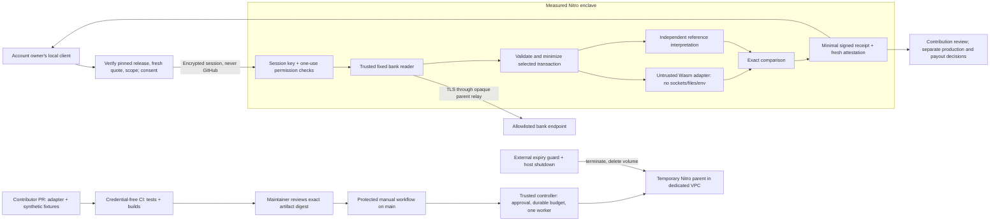

# Manual verification architecture

Status: protected infrastructure and synthetic hardware flow verified; no approved live bank release.
The current release manifest refuses bank sessions. No three-user gate applies.

The diagram describes the release design. The [October 4 operational evidence](../verification/infra/evidence/2026-10-04-operational-activation.json)
records the deployed controller, signed image, protected workflow, alerts and cleanup;
the bank policies remain disabled. The existing account is shared with Peer, at the owner's request.
The VPC has no peering or inbound rules. The worker has a dedicated role and no
production secret, KMS or role-assumption authority. The manual worker can read
only one pinned version of its private reviewed S3 bundle. The external expiry role
can terminate only instances belonging to its exact CloudFormation stack.

## Trust and privilege

- A contributor controls only the submitted adapter artifact and synthetic PR
  content. PR code is never executed in a credentialed deployment job. Workflow,
  policy, reference interpreter, signing and infrastructure changes need trusted
  maintainer review; accepting a bank adapter does not approve those changes.
- The client must independently pin the approved manifest (PCR0/1/2/8, policy,
  expiry and exact release digest), verify AWS's attestation chain, a fresh nonce
  and the session public key, then obtain owner consent. A manifest supplied by
  the same untrusted worker is insufficient. Debug measurements are rejected.
- The parent transports ciphertext. Bank TLS terminates inside the enclave. The
  reader has fixed origins, paths, operations, response limits and deadlines;
  neither the adapter nor a workflow input can choose a URL or request body.
- The Wasm guest receives only the selected transaction's necessary identifiers,
  amount, timestamp, status and payer reference. Names, balances, memos, unrelated
  transactions and credentials are excluded. Guest output is compared with an
  independent oracle; no guest string is reflected in a public report.
- Operator permissions bind the exact artifact, policy, attempt, enclave key and
  one-use challenge. Reports bind the adapter/release/policy/prompt digest tuple.
  Replay and expiry fail closed. A report has no settlement or reward authority.
- Generic freshness probes have a separate nonce domain. The owner requests a
  quote for the exact issued challenge before consent and again before encryption;
  only an unchanged, unexpired, unconsumed challenge can be re-attested. Refresh
  never allocates a challenge or extends its lifetime.
- AI review is disabled for bank records. An external model is unnecessary for
  the deterministic manual flow and is explicitly rejected by its runtime.

## Attack paths and residual risk

| Attack | Control | Residual risk |
| --- | --- | --- |
| PR changes deployment script to steal AWS credentials | Credential-free PR CI; manual job has no checkout and only invokes a pinned controller; protected main/environment | A maintainer or account administrator can change controls; branch/environment protection must be verified before activation |
| Substitute a verifier, session key or adapter | Pinned manifest, full measured image and signer PCRs, fresh AWS quote, artifact digest and bound permits | Compromised release approval, client or AWS trust infrastructure can defeat this boundary |
| Forge a session context using public attestation | Domain-separated freshness probes; context quotes require stored challenge state; controller and owner verify the exact context hash | Host can delay or consume an otherwise valid attempt; a quote does not reserve future availability |
| Adapter exfiltrates bank data | No guest network/files/env; Wasmtime fuel/memory/output/time limits; Linux UID/group drop; fixed report schema | Sandbox/kernel vulnerabilities; timing and coarse outcome covert channels; required identifiers remain sensitive |
| Bank redirect, DNS rebinding or metadata-service request | Exact approved HTTPS origin and operation; public-address checks, certificate validation, bounded relay | Bank compromise or a mistaken allowlist; parent can delay or deny traffic |
| Replay, duplicate workers or spending attack | One-use expiring session; transactional reservations; one active worker; independent expiry guard | Provider billing lag, administrator overrides and resource failures; AWS Budgets is an alert, not a hard spending cutoff |
| Verifier invents payment meaning | Independent oracle, negative fixtures and source-policy review | Shared misunderstanding of a bank field; sender's “sent” is not recipient credit or irreversible settlement |
| Leak through logs, crash or reports | No raw logging; fixed errors; core dumps disabled; private data only in memory; minimal receipts | Python memory is not guaranteed zeroized; local account/client compromise; operator misuse |
| Access Peer production | Dedicated VPC, roles, resources and signing identity; explicit worker denies for secrets, KMS and role assumption | Shared account administrators, organization controls, billing and AWS quotas remain shared |

## Cost and cleanup

Infrastructure has a separate **$50 task authorization**, unrelated to the bounty
pool. Reserve a conservative cost before each launch and retain the reservation
after a failed attempt until billing is reconciled. The retained task ledger reserves
$20 as of October 4 (including earlier tests and persistent resources through November 15),
allows one c6i.xlarge with an encrypted 24 GB root volume and no NAT gateway, and
shuts down after 110 minutes. An independent five-minute sweep terminates expired
or stopped instances in that exact stack; root volumes delete on termination.

Monitor stack state, instance age, the expiry Lambda's error alarm and the durable
cost ledger. An alarm without a tested notification route is not unattended
incident coverage. Protected operational dispatch passed durable admission,
concurrency, monitoring, rollback and cleanup checks. The public bank release remains
disabled. Reservations are conservative authority limits, not actual AWS bills.

## Release and rollback

Before requesting production approval, attach exact commits/artifact hashes,
independent build agreement, hardware attestation and negative tests, isolation
and cleanup evidence, a consenting owner's privacy-safe report, verified GitHub
protections, cost reservations and the previous deployment identifiers.

Release adapter contributions independently from the trusted verifier. Publish
an approved short-lived manifest only after review, then enable manual dispatch.
Promote the docs through `zkp2p-clients` main and `releases/docs/prod`; record and
verify the deployed SHA at `docs.peer.xyz`. Landing deployment is a separate
explicit step. No production step is authorized by a contribution merge.

Rollback: disable dispatch/admission; revoke the manifest and stop new sessions;
terminate the exact owned stack's workers; verify instance termination and volume
deletion; restore the previous reviewed docs/landing revision through normal
release history. Do not restore old authority merely to make a check pass.

References: [AWS Nitro isolation](https://docs.aws.amazon.com/enclaves/latest/user/nitro-enclave.html),
[Nitro concepts](https://docs.aws.amazon.com/enclaves/latest/user/nitro-enclave-concepts.html),
[AWS Budgets limitations](https://docs.aws.amazon.com/cost-management/latest/userguide/budgets-managing-costs.html).
