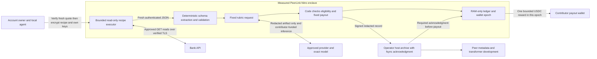

# PeerLink transcript contributions

Product decision: 2026-10-09. Status: implemented pilot candidate, **unreleased**.
The [release manifest](../transcripts/release.json) remains unreleased, no payout
wallet is funded, and no public bank submissions or paid contributions are enabled.
This document separates the built pilot, observed evidence and remaining roadmap.
Infrastructure, a verified candidate quote or a synthetic job does not activate a bank.

## Problem and outcome

Provider-authoring contributions have lacked authenticated bank evidence. PeerLink
instead collects useful, privacy-safe endpoint and transaction-history schemas from
account owners. Peer engineers use them to develop Curator metadata and attestation
transformers. Contributors do not implement providers, claim issues by commenting,
open provider PRs, or publish banking records.

The local agent learns an authorized read-only recipe. The account owner supplies
their own bank session and approved inference API key, encrypted to an independently
verified PeerLink enclave. Code acquires fresh bank responses, deterministically
redacts them, asks a model to grade only the structural artifact, checks eligibility,
and pays the published fixed reward when an enabled campaign accepts the evidence.
The model does not choose bank reads, change policy or sign payments in this pilot.

## Product decisions

- One campaign issue per bank, retaining existing issue URLs where possible.
  Publish scope, source access status, fixed reward, available slots and the skill.
- Collect **1–5 distinct contributors per bank**, normally targeting five and
  stopping earlier when the evidence is sufficient.
- Fixed **$5 or $10 USDC per accepted contribution**. Initial US campaigns use
  $10; other rates are explicit campaign policy, not inferred from personal data.
- At most one paid contribution per contributor/account per bank campaign.
  Multiple wallets or GitHub accounts do not prove distinct people; account-based
  deduplication is not proof of humanity. The current epoch limitation is below.
- Contributors pay inference even when jobs fail or are rejected. Show provider,
  model, privacy consent, limits and possible reward before releasing credentials.
- Peer pays infrastructure, payout gas and accepted rewards. No Peer inference key,
  environment-key fallback or alternate billing route exists in the job runtime.
- The pilot configures a **$50 USDC ceiling** and separate bounded gas, not a claim
  of deposited funds. Fund only an independently verified epoch after approval.
  No automatic refill; reserve slots and budget before paid inference.
- Preserve the landing design and concise tone. Detailed mechanics belong in the
  [contribution skill](../skills/contribute-transcript/SKILL.md) and docs.

## Built pilot architecture



Bank acquisition and grading are separate calls. Bank/provider TLS terminates
inside the enclave; the parent relay forwards ciphertext and sees approved
hostnames, not credentials or response plaintext. Code pins bank origin/path/GET,
account identity, deadlines, response sizes, source/model policy and money limits.
The fixed recipe cannot execute contributed code, shell commands or arbitrary URLs.

The pilot has a Wise identity/acquisition adapter. It reads authenticated profiles,
checks explicit selection when multiple profiles exist, reads standard balances,
and proves statement balance membership. The artifact records authenticated profile-to-balance-to-history relationships
using templated path parameters, and the policy allowlists 59 public schema field
names. A submitted account ID alone establishes nothing. Generic banks remain in source review until they have their own demonstrated
safe acquisition and identity extraction.

Uploaded local `notes` and `transcript` are untrusted, unused inputs in this pilot:
they neither authenticate evidence nor enter grading or retained artifacts. The
validated recipe guides actual acquisition. Endpoint annotations from local notes
may be considered in a future version only after deterministic privacy validation.
There is no model-directed bank-tool loop in the built pilot.

### Privacy and inference modes

**Implemented ordinary mode:** the contributor explicitly consents to the named
approved provider/model and routing. Deterministic redaction precedes inference.
Only the validated structural artifact and fixed grading instructions leave the
PeerLink enclave for the model. Raw bank values, bank-session credentials and payout
keys never enter prompts. The contributor's inference key authenticates that one
pinned provider request; it is not prompt content. Peer enclave protection does not
establish an external provider's confidentiality or retention policy.

OpenAI and OpenRouter routes use approved exact models; OpenRouter pins its reviewed
upstream without provider/model fallback. No arbitrary contributor grading endpoint
is accepted. The adapter checks structured results and reported usage, and stops
rather than spending again after uncertain failure.

The ordinary NEAR route is implemented for canonical `z-ai/glm-5.3-flash`,
with explicit consent to NEAR and its approved Chutes upstream. It requests no
aliasing, rejects alias/model mismatches and unapproved serving-provider headers,
and makes at most one grading call. Those gateway assertions over TLS are not
independent model attestation. Live funded inference remains unverified.

Token/call/deadline limits are not a guaranteed exact monetary cap, especially with delayed provider quotas.

**Confidential NEAR roadmap:** unavailable until a reviewed attestation/E2EE adapter
has passed real keyed request/response verification. Public research on 2026-10-08
found the live gateway TDX TCB reported as `OutOfDate`; the SDK's permissive default
is not PeerLink's approval. The built adapter fails closed on confidential mode
and cannot silently downgrade to provider-visible inference.

The official [NEAR quickstart](https://docs.near.ai/cloud/quickstart) and researched
source/public probes support a dashboard-credit, contributor-API-key integration
in principle. No valid-key billable test has yet demonstrated it for this pilot.
The observed crypto-credit checkout redirects to PingPay and displays a route
via NEAR Intents. That credit-funding checkout is a separate layer from the
API-key inference protocol; it is not per-request inference settlement. No x402
route has been verified, and ordinary HTTP 402/out-of-credits is not an x402
payment challenge. Do not advertise supported confidential inference or a verified
NEAR dollar ceiling. A dedicated key with a $0.25 dashboard limit exists, but
the account has no credits and no funded inference test at this checkpoint.
Re-check live keyed behavior, routing, attestation policy and billing before
enabling the route for public collection.

### What inference digests establish

The measured policy pins the fixed system-prompt digest. Receipts record the digest
of the exact canonical grading request sent and the canonical parsed grade result,
plus provider/model, privacy mode and reported usage. `responseDigest` identifies
the accepted grade object, not every byte of the raw provider response.

These are claims signed by the measured PeerLink runtime about its HTTPS interaction.
They are **not independent provider/model cryptographic proof**, model accuracy,
confidential computation, or a complete provider-to-final-response attestation chain.
A future confidential adapter must verify its own preflight evidence, encrypted
request/response and byte/signature bindings independently.

## Contribution journey

```mermaid
sequenceDiagram
  participant Owner as Owner and local agent
  participant TEE as Verified PeerLink enclave
  participant Bank as Bank API
  participant AI as Approved inference provider
  participant Store as Redacted archive
  participant Base as Base USDC
  Owner->>TEE: Reserve fixed terms and reward capacity
  TEE-->>Owner: Fresh attestation binding code, policy and encryption key
  Owner->>Owner: Verify independent release pin and consent
  Owner->>TEE: Encrypt recipe, bank token and own inference key
  TEE->>Bank: Approved authenticated read-only requests
  Bank-->>TEE: Actual account and transaction-history responses
  TEE->>TEE: Check identity, eligibility and duplicates; redact values
  TEE->>AI: Fixed prompt and structural artifact, billed to owner's key
  AI-->>TEE: Structured grade
  TEE->>TEE: Apply fixed acceptance and reward rules
  TEE->>Store: Signed redacted artifact and inference evidence
  Store-->>TEE: Persisted-record acknowledgment
  TEE->>Base: Sign and reconcile one fixed reward
  TEE-->>Owner: Verifiable artifact and payment receipt
  Owner->>Owner: Revoke dedicated credentials using provider controls
```

1. Check the approved release and active bank campaign, source compatibility,
   fixed reward, capacity, privacy terms and provider/model before gathering a session.
2. The owner signs in and completes MFA. The local agent observes transaction
   history and relevant existing details. Passwords, MFA codes, payments and account
   changes are outside the contribution.
3. Prepare the versioned read-only recipe and bounded encrypted payload. Do not
   rely on local notes or captures as authenticated evidence.
4. Reserve a job binding campaign, recipient, provider/model, consent, limits and
   expiry. Capacity/funding rejection precedes paid inference. Save its public
   recovery handle locally before submission.
5. Independently verify fresh Nitro attestation against the pinned approved release,
   including quote nonce/age, image/signer measurements, key and policy bindings.
   Reject debug, stale or unreleased images. Encrypt secrets directly to that key.
6. The enclave performs approved bank reads over TLS, derives live account identity,
   checks history coverage and extracts a validated redacted artifact.
7. Grade that artifact with only the contributor's key. Code checks the versioned
   rubric, supported model/provider, usefulness and mandatory eligibility.
8. Sign the redacted acceptance record and require the operator-host archive
   acknowledgment. Then reconcile the one fixed payout within the running epoch.
   Post-payment archive failure must not create a new payment.
9. Return fixed status/reason codes and the signed artifact/inference/payout receipt
   when available. Revoke the inference key and use bank logout/session controls.
   Logout does not universally revoke bank API tokens; Python reference removal
   does not guarantee zeroization. Enclave destruction is the final erasure boundary.

### Client recovery commands

Run `terms --campaign <campaign-id>` in the transcript virtual environment to
show the selected route, reward, Base USDC network, privacy mode, costs/limits and
release status without collecting secrets. It does not reserve capacity or enable
an unreleased campaign.

The `contribute` CLI command accepts `--state .local/job-state.json` and writes a
non-overwriting recovery handle containing public reservation metadata, never keys.
Trusted local tooling can supply the secret payload through stdin. Alternatively,
`--prompt-secrets` asks the owner on a controlling TTY after verified preflight,
while stdin contains only the nonsecret recipe payload. Secrets never enter command
arguments, chat or environment fallback. Unreleased preflight stops before secret input.

Use the virtual environment installed by `npm run transcripts:setup`. If submission/status
is uncertain, recover the **same job** instead of resubmitting:

```sh
.local/transcript-venv/bin/python -m transcripts.cli job --state .local/job-state.json
.local/transcript-venv/bin/python -m transcripts.cli receipt --state .local/job-state.json
```

The runtime `/v1/release` route is discovery-only and names the canonical release
source. Approved final PCRs are published separately after the image is built;
embedding its own final measurement manifest in the image would be circular.

Use the independently pinned `--release` and `--policy` files when selecting a
reviewed checkout. `receipt` obtains fresh preflight and verifies the enclave signature
and bindings; reported status alone is not authenticated payment evidence. Restoring
the client handle does not restore a lost enclave epoch or its wallet.

## Contracts

### Campaign and submission

A campaign specifies version, bank/country/issue, integer USDC reward minor units,
1–5 contributor capacity, approved origins/paths/methods, provider/model/privacy
routes, rubric and structural evidence requirements. Bound reservation terms do
not change retroactively when the catalog changes. USDC has 6 decimals.

The encrypted payload contains bank credential, selected profile, recipe,
contributor inference key and bounded unused local notes/transcript fields. Its
single-use encryption context binds job, reservation, fresh challenge, epoch,
payout wallet, policy and expiry. No arbitrary code, endpoints or callbacks.
Credentials are transient; errors, logs and receipts contain fixed codes or validated
public structures only. Cloud-backed local browser agents remain a separate consent
boundary from PeerLink's model grading.

### Redacted artifact and archive

Artifacts retain verified origins, templated endpoints, safe parameter/header names,
field paths/types, list/detail relationships, coverage, limitations and redacted
read flow. Remove raw cookies/tokens, account numbers, names, balances, exact amounts,
memos and transaction IDs, including URL/query values and dynamic object keys.
History eligibility is checked inside the enclave; the exported artifact contains
only `historyMinimumSatisfied: true`, never the private transaction count.
Unknown names become structural wildcards. Model free text is not stored as a
supposedly safe transcript.

The runtime validates the complete export before signing, including grade/inference
metadata and public epoch/job bindings. The host archive writes canonical signed
records, fsyncs the file, atomically renames it and fsyncs its directory before
acknowledging the digest. This is an **operator-host availability dependency**:
the enclave cannot prove host disk persistence or prevent deletion/withholding.
The host archive is not a confidential trusted ledger, rollback authority, wallet
backup or state-restoration route. Signatures/digests help verify retrieved records,
not guarantee their availability. Do not overstate durable storage or recovery.

Private purpose-scoped keyed account fingerprints come only from live bank evidence
and stay in the epoch ledger. Public receipts contain opaque IDs and hashes of
already-redacted artifacts; never publish ordinary hashes of guessable bank values.

### State, epoch and payout

`reserved -> submitted -> verifying -> accepted -> payout_pending -> paid`.
Nonpayment outcomes include `rejected`, `expired` and `cancelled`. Uncertain chain
submission remains `payout_pending`; the coordinator reuses/reconciles the same
signed transaction identity. Atomic slot/budget reservation, duplicates and nonce
selection are enforced within one running epoch.

The pilot generates a new wallet and authority **inside Nitro at boot**. Wallet
key, integrity/dedup keys, ledger, nonce state and in-process receipts are RAM-only.
No key import/export, automatic restore, automatic refill or host-state replay path
exists. Admission starts paused. Independently verify that exact epoch, fund at
most the configured $50 USDC and bounded gas once, then explicitly activate it.
No wallet has been funded at this document's evidence checkpoint.

A restart destroys the key and authoritative history. Deduplication and limits do
**not** carry across epochs; archives cannot reconstruct signing authority or make
new payments safe. A replacement epoch begins paused/unfunded. Do not automatically
continue the same funded campaign or describe this as restart-safe production.
Cross-epoch duplicate reconciliation, persistent rollback-safe authority, recoverable
custody and durable payment reconciliation remain roadmap/release work.

### Built operator retirement

A signed operator `retire` action irreversibly closes admission for this epoch and
cancels unused reservations. Submitted/verifying/accepted/payment obligations must
finish, and pending signed records must archive before retirement can complete.
The runtime then refunds the remaining bounded USDC balance only to the fixed
deployer address, reconciling the same refund transaction identity. No arbitrary
refund recipient, ETH sweep, automatic refill or post-restart recovery exists.
Do not stop a funded enclave before its obligations and refund are independently
confirmed. The flow is implemented with synthetic tests; no live refund is claimed
at this evidence checkpoint.

## Acceptance and abuse bounds

Fresh authorized bank reads, approved TLS destination/GET, authenticated account,
useful history structure, supported inference/consent, job binding, no duplicate
award in the epoch, reserved budget, validated artifact and archive acknowledgment
are mandatory. A model score cannot override these checks or choose reward,
recipient, source, trust policy or signing action.

The owner accepts bounded model-judgment/prompt-injection risk for a supervised
pilot. The grader has no bank tools and sees only structural data. Use fixed rubric,
small funded wallet, operator pause and redacted review. Prompt padding is not a
proof against injection. Keep all spend/tool limits in code. Broad unattended
acceptance remains closed until the measured-release and remaining evidence gates pass.

## Evidence checkpoint: 2026-10-09

| Area | Observed evidence | What remains unavailable or unproven |
| --- | --- | --- |
| Synthetic transcript suite | 121 credential-free tests passed across policy, bank/provider transports, redaction, epoch, ledger/payout, encrypted runtime, client recovery/receipt, Wise relationships, NEAR ordinary routing and retirement checks. Private history counts are rejected at artifact and archive boundaries. | Fixtures/mocks do not prove live hardware, banking, inference or money movement. |
| Wise read-only local acquisition | Three owner-authorized API reads succeeded for profiles, standard balances and a statement with valid nonempty history; extraction produced 79 structural field paths without retaining private values. | This was local/direct acquisition, not a Wise job executed inside the TEE. No personal identifiers or history counts are published. |
| Nitro candidate hardware | The final committed candidate passed fresh AWS certificate, COSE signature, nonce/key/policy/epoch and PCR checks. Two independent CI builds matched, and deployed PCR0/1/2 plus every measured input match CI. See [candidate evidence](../transcripts/candidate-evidence.json). | Candidate verification is not a published approved release or live bank acceptance. The checked-in release remains unreleased and the wallet is unfunded. |
| Inference | Ordinary pinned-provider adapter and usage/result checks have synthetic coverage. NEAR official-doc/source research and keyed hardware probes completed: the model quote was UpToDate, but the gateway quote was OutOfDate; TLS binding matched. | NEAR has a $0.25-limited key but no account credits; no funded live inference, billing receipt or verified NEAR E2EE route demonstrated for this release. |
| Rewards | Fixed Base USDC signing, transaction/receipt validation, archive ordering and within-epoch retry invariants have synthetic coverage. | No live payout/refund demonstrated; the $50 limit is configuration, not evidence of deposited funds. No cross-epoch recovery guarantee. |
| Contributor-agent trials | Claude Opus 5.5 high and Codex high reviewed the local contributor flow. Their findings drove safe secret prompts, clear release gates, recovery commands, receipt checks and Wise relationship fixes. Claude's final follow-up found the practical fixes intact and passed 33 targeted client/artifact tests. | These credential-free trials are not funded enrollment. Live same-job recovery, provider billing and payout still require the funded pilot. |
| Public availability | Landing/docs/catalog describe the new contribution program with readiness gates. | No claim that all banks are ready, funded or supported in Peer. |

Evidence must remain scoped to its actual source/image version and observation date.
Later tests or live checks update this matrix only with inspectable redacted proof.
Do not publish personal account identifiers, private values or personal history counts.

## GitHub migration and release roadmap

Completed migration: all 41 existing campaign issues were updated in place, with
their previous terms archived, and all 81 pre-migration PRs were closed with
transition notices. The valid legacy assignment and its original $50 commitment
remain preserved. Every issue/archive and PR/notice was read back after migration.

Snapshot existing issues/open PRs and previous text before edits. Close the
pre-migration PR set with a respectful program-change notice and new instructions;
keep commits, discussions and links, and exclude new implementation PRs. Update
bank issues in place, preserving scope/history while replacing retired provider/PR
and Merit/$50-per-provider enrollment terms. Preserve previously earned/accepted
obligations and review old disputes under original terms. The new rates do not
retroactively cancel prior acceptance. Keep source-review, paused, collection and
completed campaigns distinguishable; never promise all banks are funded.

Use the dedicated transcript Nitro service, not production attestor hosts or keys.
Keep bank/provider TLS and secrets inside the intended boundary. Publish authentic
measurements, source/prompt/policy provenance and independently verifiable deployment
metadata before any approved secret submission. Follow
[operations](transcript-operations.md) for supervision, cost limits and rollback.

Release work still requires:

- Fresh independent reviews and source/image provenance, authentic measured release
  publication and client rejection of invalid/debug/stale/key/policy mismatches.
- Real contributor-funded inference, accurate billing evidence and failure with
  unavailable funds; never fallback to a Peer key. Validate NEAR separately and
  advertise no unsupported x402 or confidential route; distinguish credit top-up checkout from inference settlement.
- An explicitly owner-authorized Wise flow **inside the TEE**, including acquisition,
  identity, redaction, provider grading and receipt checks before live acceptance.
- Exact epoch funding, bounded real USDC transfer, recipient/chain receipt evidence,
  no duplicate payout, and safe supervised disposition of remaining funds.
- A funded contributor trial that exercises same-job recovery without repeated
  submissions, building on the completed credential-free Claude/Codex trials.
- Activation of demonstrated source campaigns only, after the remaining evidence
  gates; merged code, public docs and migrated issues do not activate collection.
- For durable/broad service: persistent rollback-safe authority, cross-epoch dedup,
  recoverable custody, durable reconciliation and verified archive availability.

Maintain one private task spend ledger for hosting, inference, rewards and gas.
No synthetic result, candidate quote or local bank check substitutes for remaining
release gates. Existing adapters remain reference assets; unrelated Peer trading,
extension behavior and production attestation services are outside this revamp.
