# PeerLink transcript contributions

Product decision: 2026-10-09. Status: implemented pilot candidate, **unreleased**.
The [release manifest](../transcripts/release.json) remains unreleased and no public
bank submissions or paid contributions are enabled. The earlier enclave-only wallet
holds unrecovered $50; the revised KMS candidate is a separate wallet and release.
This document separates the built pilot, observed evidence and remaining roadmap.
Infrastructure, a verified candidate quote or a synthetic job does not activate a bank.

## Public launch candidate — in progress

The next release is preparing [Wise campaign #239](https://github.com/zkp2p/peer-link/issues/239)
only: up to two distinct contributors at **$5 USDC per accepted transcript**,
with a planned $10 budget reserved before admission. Other bank
pages remain planned. No public job is available until the approved measured
release, funded campaign and remaining capacity are independently verified.

The v3 design encrypts canonical SQLite state snapshots under AES-GCM, with an
immutable AWS Lambda/DynamoDB compare-and-swap authority. Descriptor v3 binds
`ledgerPersistence: aws_dynamodb_encrypted_snapshot`, `stateNamespace`,
`stateAuthorityArn` and `stateWrappingKeyId` alongside the payout fields. KMS
Recipient decryption checks the approved PCR0/host-role PCR3 bindings; AWS HTTPS
terminates inside the enclave. Atomic revision/writer-generation checks fence
stale workers. Accepted grade/artifact metadata commits atomically, and exact
signed transaction bytes/nonce persist before broadcast.

Restore preserves the same epoch and encrypted durable receipt-signing key only for the exact
policy digest, campaigns, wallet, namespace and immutable authority. It starts
paused until signed operator resume and chain reconciliation; changed policy cannot
silently restore or initialize previously funded state. Interrupted submitted or
verifying work fails as `interrupted_execution` without rerunning bank or model
calls. A reserved job retains its expiry and needs a fresh challenge, explicit owner
consent and new secrets before any submission.

Bank sessions, inference keys, raw reads and submission envelopes never enter the
snapshot. Ingress RSA private keys are fresh per boot and never persisted; only the
separate receipt signer is encrypted in durable state. Later snapshot recovery
cannot recover old bank-upload decryption keys. KMS administrators remain trusted
for encrypted metadata/deduplication secrecy, and cloud availability remains a
trust boundary; missing, mismatched or unavailable state must
stop admission. These protections are under implementation and verification, not
approved public availability.

## Problem and outcome

Provider-authoring contributions have lacked authenticated bank evidence. PeerLink
instead collects useful, privacy-safe endpoint and transaction-history schemas from
account owners. Peer engineers use them to develop Curator metadata and attestation
transformers. Contributors do not implement providers, claim issues by commenting,
open provider PRs, or publish banking records.

The local agent learns an authorized read-only recipe. The account owner supplies
their own bank session and approved inference API key, encrypted to an independently
verified PeerLink enclave. Code acquires fresh bank responses, deterministically
redacts them, asks a model to grade only the structural artifact, checks eligibility,
and pays the published fixed reward when an enabled campaign accepts the evidence.
The model does not choose bank reads, change policy or sign payments in this pilot.

## Product decisions

- One campaign issue per bank, retaining existing issue URLs where possible.
  Publish scope, source access status, fixed reward, available slots and the skill.
- Architecture supports **1–5 distinct contributors per bank**, stopping when
  evidence is sufficient. The supervised Wise experiment has a **one-slot limit**
  and measured $5 budget. Its test consumed that slot/budget; remaining funded
  capacity is zero and public collection stays closed.
- Fixed **$5 or $10 USDC per accepted contribution**. Initial US campaigns use
  $10; other rates are explicit campaign policy, not inferred from personal data.
- At most one paid contribution per contributor/account per bank campaign.
  Multiple wallets or GitHub accounts do not prove distinct people; account-based
  deduplication is not proof of humanity. The current epoch limitation is below.
- Contributors pay inference even when jobs fail or are rejected. Show provider,
  model, privacy consent, limits and possible reward before releasing credentials.
- Peer pays infrastructure, payout gas and accepted rewards. No Peer inference key,
  environment-key fallback or alternate billing route exists in the job runtime.
- The architecture permits a **$50 USDC maximum** and separate bounded gas. The
  revised candidate's measured budget is **$5 USDC**, following a separate confirmed
  $1 recovery test, now verified. The supervised Wise job paid the allocated $5;
  that completed test does not enable further funding or public collection.
  Fund only an independently verified epoch and its exact budget after approval.
  No automatic refill; reserve slots and budget before paid inference.
- Preserve the landing design and concise tone. Detailed mechanics belong in the
  [contribution skill](../skills/contribute-transcript/SKILL.md) and docs.

## Built pilot architecture

```mermaid
flowchart LR
  Local[Account owner and local agent] -->|Verify fresh quote then encrypt recipe and own keys| Runner
  subgraph TEE[Measured PeerLink Nitro enclave]
    Runner[Bounded read-only recipe executor] -->|Fresh authenticated JSON| Redact[Deterministic schema extraction and validation]
    Redact --> Grade[Fixed rubric request]
    Grade --> Decide[Code checks eligibility and fixed payout]
    Decide --> Epoch[Campaign ledger and payout state]
  end
  Runner <-->|Approved GET reads over verified TLS| Bank[Bank API]
  Grade <-->|Redacted artifact only and contributor-funded inference| Model[Approved provider and exact model]
  Decide -->|Signed redacted record| Archive[Operator host archive with fsync acknowledgment]
  Archive -->|Required acknowledgment before payout| Epoch
  Epoch -->|Runtime-validated payout digest| Broker[Host KMS signing broker]
  Broker --> KMS[Non-exportable AWS KMS payout key]
  Operator[Authorized operator IAM] -->|Independent signing and fund recovery| KMS
  KMS -->|Signature| Epoch
  Epoch -->|Broadcast validated Base USDC transfer| Wallet[Contributor payout wallet]
  Archive --> Engineers[Peer metadata and transformer development]
```



Bank acquisition and grading are separate calls. Bank/provider TLS terminates
inside the enclave; the parent relay forwards ciphertext and sees approved
hostnames, not credentials or response plaintext. Code pins bank origin/path/GET,
account identity, deadlines, response sizes, source/model policy and money limits.
The fixed recipe cannot execute contributed code, shell commands or arbitrary URLs.
Payout signing is a separate KMS trust boundary. Authorized operator IAM and the
host broker can sign outside the enclave; measured runtime limits do not constrain
an operator signing independently. No exclusive-enclave or PCR-restricted KMS
access is claimed. Bank and inference credentials are not sent to the broker.

The pilot has a Wise identity/acquisition adapter. It reads authenticated profiles,
checks explicit selection when multiple profiles exist, reads standard balances,
and proves statement balance membership. The artifact records authenticated profile-to-balance-to-history relationships
using templated path parameters, and the policy allowlists 59 public schema field
names. A submitted account ID alone establishes nothing. Generic banks remain in source review until they have their own demonstrated
safe acquisition and identity extraction.

Uploaded local `notes` and `transcript` are untrusted, unused inputs in this pilot:
they neither authenticate evidence nor enter grading or retained artifacts. The
validated recipe guides actual acquisition. Endpoint annotations from local notes
may be considered in a future version only after deterministic privacy validation.
There is no model-directed bank-tool loop in the built pilot.

### Privacy and inference modes

**Implemented ordinary mode:** the contributor explicitly consents to the named
approved provider/model and routing. Deterministic redaction precedes inference.
Only the validated structural artifact and fixed grading instructions leave the
PeerLink enclave for the model. Raw bank values, bank-session credentials and payout
keys never enter prompts. The contributor's inference key authenticates that one
pinned provider request; it is not prompt content. Peer enclave protection does not
establish an external provider's confidentiality or retention policy.

OpenAI and OpenRouter routes use approved exact models; OpenRouter pins its reviewed
upstream without provider/model fallback. No arbitrary contributor grading endpoint
is accepted. The adapter checks structured results and reported usage, and stops
rather than spending again after uncertain failure.

The ordinary NEAR route is implemented for canonical `z-ai/glm-5.3-flash`,
with explicit consent to NEAR and its approved Chutes upstream. It requests no
aliasing, rejects alias/model mismatches and unapproved serving-provider headers,
and makes at most one grading call. Those gateway assertions over TLS are not
independent model attestation. Paid provider-visible tool-call and strict-JSON
schema checks passed; confidential inference remains unavailable.

The client defaults to 2048 output tokens; the NEAR request sets low reasoning
effort within that reserved limit. Explicitly lower contributor limits remain
binding, and uncertain failures do not trigger an automatic paid retry.
Token/call/deadline limits are not a guaranteed exact monetary cap, especially with delayed provider quotas.

**Confidential NEAR roadmap:** unavailable until a reviewed attestation/E2EE adapter
has passed real keyed request/response verification. Public research on 2026-10-08
found the live gateway TDX TCB reported as `OutOfDate`; the SDK's permissive default
is not PeerLink's approval. The built adapter fails closed on confidential mode
and cannot silently downgrade to provider-visible inference.

The official [NEAR quickstart](https://docs.near.ai/cloud/quickstart) and researched
source/public probes support a dashboard-credit, contributor-API-key integration.
On 2026-10-09, one dollar of merchant credit was verified after a 1.015099 Base
USDC payment, and a real tool-call response was billed to the dedicated key.
The observed crypto-credit checkout redirects to PingPay and displays a route
via NEAR Intents. That credit-funding checkout is a separate layer from the
API-key inference protocol; it is not per-request inference settlement. No x402
route has been verified, and ordinary HTTP 402/out-of-credits is not an x402
payment challenge. Do not advertise supported confidential inference or a verified
NEAR dollar ceiling. The dedicated key was rotated in RAM. The live tool-call
and strict-JSON retry both passed schema validation. The retry used 2048 output
tokens and low reasoning effort, completed with `finish_reason=stop`, and billed
271,250 nano-USD. Gateway TCB remains OutOfDate, so this is evidence
for the provider-visible route, not confidential inference.
Re-check live keyed behavior, routing, attestation policy and billing before
enabling the route for public collection.

### What inference digests establish

The measured policy pins the fixed system-prompt digest. Receipts record the digest
of the exact canonical grading request sent and the canonical parsed grade result,
plus provider/model, privacy mode and reported usage. `responseDigest` identifies
the accepted grade object, not every byte of the raw provider response.

These are claims signed by the measured PeerLink runtime about its HTTPS interaction.
They are **not independent provider/model cryptographic proof**, model accuracy,
confidential computation, or a complete provider-to-final-response attestation chain.
A future confidential adapter must verify its own preflight evidence, encrypted
request/response and byte/signature bindings independently.

## Contribution journey

```mermaid
sequenceDiagram
  participant Owner as Owner and local agent
  participant TEE as Verified PeerLink enclave
  participant Bank as Bank API
  participant AI as Approved inference provider
  participant Store as Redacted archive
  participant Base as Base USDC
  Owner->>TEE: Reserve fixed terms and reward capacity
  TEE-->>Owner: Fresh attestation binding code, policy and encryption key
  Owner->>Owner: Verify independent release pin and consent
  Owner->>TEE: Encrypt recipe, bank token and own inference key
  TEE->>Bank: Approved authenticated read-only requests
  Bank-->>TEE: Actual account and transaction-history responses
  TEE->>TEE: Check identity, eligibility and duplicates; redact values
  TEE->>AI: Fixed prompt and structural artifact, billed to owner's key
  AI-->>TEE: Structured grade
  TEE->>TEE: Apply fixed acceptance and reward rules
  TEE->>Store: Signed redacted artifact and inference evidence
  Store-->>TEE: Persisted-record acknowledgment
  TEE->>Base: Sign and reconcile one fixed reward
  TEE-->>Owner: Verifiable artifact and payment receipt
  Owner->>Owner: Revoke dedicated credentials using provider controls
```

1. Check the approved release and active bank campaign, source compatibility,
   fixed reward, capacity, privacy terms and provider/model before gathering a session.
2. The owner signs in and completes MFA. The local agent observes transaction
   history and relevant existing details. Passwords, MFA codes, payments and account
   changes are outside the contribution.
3. Prepare the versioned read-only recipe and bounded encrypted payload. Do not
   rely on local notes or captures as authenticated evidence.
4. Reserve a job binding campaign, recipient, provider/model, consent, limits and
   expiry. Capacity/funding rejection precedes paid inference. Save its public
   recovery handle locally before submission.
5. Independently verify fresh Nitro attestation against the pinned approved release,
   including quote nonce/age, image/signer measurements, key and policy bindings.
   Reject debug, stale or unreleased images. Encrypt secrets directly to that key.
6. The enclave performs approved bank reads over TLS, derives live account identity,
   checks history coverage and extracts a validated redacted artifact.
7. Grade that artifact with only the contributor's key. Code checks the versioned
   rubric, supported model/provider, usefulness and mandatory eligibility.
8. Sign the redacted acceptance record and require the operator-host archive
   acknowledgment. Then reconcile the one fixed payout within the running epoch.
   Post-payment archive failure must not create a new payment.
9. Return fixed status/reason codes and the signed artifact/inference/payout receipt
   when available. Revoke the inference key and use bank logout/session controls.
   Logout does not universally revoke bank API tokens; Python reference removal
   does not guarantee zeroization. Enclave destruction is the final erasure boundary.

### Client recovery commands

Run `terms --campaign <campaign-id>` in the transcript virtual environment to
show the selected route, reward, Base USDC network, privacy mode, costs/limits and
release status without collecting secrets. It does not reserve capacity or enable
an unreleased campaign.

The `contribute` CLI command accepts `--state .local/job-state.json` and writes a
non-overwriting recovery handle containing public reservation metadata, never keys,
before reading stdin or prompting. The CLI uses fixed default limits.
Trusted local tooling can supply the secret payload through stdin. Alternatively,
`--prompt-secrets` asks the owner on a controlling TTY after verified preflight,
while stdin contains only the nonsecret recipe payload. Secrets never enter command
arguments, chat or environment fallback. Unreleased preflight stops before secret input.

Use the virtual environment installed by `npm run transcripts:setup`. If submission/status
is uncertain, recover the **same job** instead of resubmitting:

```sh
.local/transcript-venv/bin/python -m transcripts.cli job --state .local/job-state.json
.local/transcript-venv/bin/python -m transcripts.cli receipt --state .local/job-state.json
```

To continue only an unexpired reserved job, run `submit-reserved --state
.local/job-state.json --consent --prompt-secrets` with the recipe on stdin. It
verifies saved terms, fresh attestation and reserved status before keys, prints the
original payout/route/limits, and creates no reservation or state overwrite. Payout,
campaign, provider and model overrides are rejected. The SDK equivalent is explicit
`Client.restore(state)` and `submit_reserved(payload, consent=True)`. Restart
changes ingress keys, while the same durable receipt signer and epoch remain pinned.
An independently reviewed expiry-only manifest renewal preserves that handle;
changes to service, policy or measurement pins do not.

The runtime `/v1/release` route is discovery-only and names the canonical release
source. Approved final PCRs are published separately after the image is built;
embedding its own final measurement manifest in the image would be circular.

Use the independently pinned `--release` and `--policy` files when selecting a
reviewed checkout. `receipt` obtains fresh preflight and verifies the enclave signature
and bindings; reported status alone is not authenticated payment evidence. Restoring
the client handle does not restore a lost enclave ledger or make funded-wallet reuse safe.

## Contracts

### Planned v3 durable contract

The v3 descriptor retains `epochId`, `payoutWallet`, `chainId`, `usdcContract`,
`budgetMinor`, `maxGasFundingWei`, `payoutKeyCustody`, `payoutKeyId` and
`operatorRecovery` from v2, with `version: 3`,
`ledgerPersistence: aws_dynamodb_encrypted_snapshot`,
`restartRequiresOperatorReview: true`, and exact `stateNamespace`,
`stateAuthorityArn`, `stateWrappingKeyId`. The authority ARN identifies an immutable
Lambda version. Clients must bind these fields to the approved measured policy;
old v2 evidence cannot approve this new contract.

A stable HKDF master derives integrity, deduplication, state-encryption and
write-authorization keys.
The durable RSA-3072 receipt signer is encrypted in the snapshot. A separate
RSA-3072 ingress key is fresh per boot and never persisted; KMS uses another
ephemeral RSA-2048 Recipient key. Canonical snapshot encryption
and persistent signatures do not authenticate a mutable host's own claims: state
load/commit responses use verified AWS HTTPS inside the TEE, with exact namespace,
revision, writer generation and ciphertext digest checks. The authority stores only
ciphertext and the wrapped master. Credentials, raw bank responses and submitted
ciphertext envelopes are never included in durable state.

Fresh preflight attestation context v2 includes `receiptPublicKey`; the AWS quote
binds the hashed context and current ingress public key. Challenge v2 adds
`receiptKeyDigest`. Public client state v2 pins the durable receipt public key and
stable job epoch. Restore discards the old ingress key and validates a fresh quote
before trusting a new one, requiring unchanged receipt signer, epoch and policy.
Receipts use the durable signer. This is a changed protocol needing its own
measured-build/hardware/restart evidence before public approval.

### Completed one-slot pilot contract

The exact v2 descriptor below belongs to the completed RAM-only pilot. The durable
release must publish and verify its own measured state contract before activation.

### Campaign and submission

A campaign specifies version, bank/country/issue, integer USDC reward minor units,
1–5 contributor capacity, approved origins/paths/methods, provider/model/privacy
routes, rubric and structural evidence requirements. Bound reservation terms do
not change retroactively when the catalog changes. USDC has 6 decimals.

Wise duplicate checks compare private keyed hashes of every profile ID returned by
the authenticated profile endpoint. An overlapping profile set cannot earn another
slot by selecting a different personal or business profile. These hashes remain
inside encrypted state. This identifies overlapping bank access, not unique people.

The encrypted payload contains bank credential, selected profile, recipe,
contributor inference key and bounded unused local notes/transcript fields. Its
single-use encryption context binds job, reservation, fresh challenge, epoch,
payout wallet, policy and expiry. No arbitrary code, endpoints or callbacks.
Credentials are transient; errors, logs and receipts contain fixed codes or validated
public structures only. Cloud-backed local browser agents remain a separate consent
boundary from PeerLink's model grading.

The measured policy includes `payoutAuthority` with `kind: aws_kms`, an immutable
KMS key ARN and its derived wallet. Epoch descriptor v2 has exactly `version`,
`epochId`, `payoutWallet`, `chainId`, `usdcContract`, `budgetMinor`,
`maxGasFundingWei`, `payoutKeyCustody`, `payoutKeyId`, `operatorRecovery`,
`ledgerPersistence` and `restartRequiresOperatorReview`. Clients and archive
validators require the key ARN/wallet to match measured policy, custody to be
`aws_kms`, operator recovery and restart review to be `true`, and ledger persistence
to be `enclave_ram_only`. A v1 enclave-only descriptor is rejected for this release.
The measured policy also fixes integer `pilotBudgetMinor` from 5,000,000 to
50,000,000 USDC minor units. Descriptor `budgetMinor` must equal it exactly;
the architecture maximum does not authorize depositing $50 for a $5 candidate.

### Redacted artifact and archive

Artifacts retain verified origins, templated endpoints, safe parameter/header names,
field paths/types, list/detail relationships, coverage, limitations and redacted
read flow. Remove raw cookies/tokens, account numbers, names, balances, exact amounts,
memos and transaction IDs, including URL/query values and dynamic object keys.
History eligibility is checked inside the enclave; the exported artifact contains
only `historyMinimumSatisfied: true`, never the private transaction count.
Unknown names become structural wildcards. Model free text is not stored as a
supposedly safe transcript.

The runtime validates the complete export before signing, including grade/inference
metadata and public epoch/job bindings. The host archive writes canonical signed
records, fsyncs the file, atomically renames it and fsyncs its directory before
acknowledging the digest. This is an **operator-host availability dependency**:
the enclave cannot prove host disk persistence or prevent deletion/withholding.
The host archive is not a confidential trusted ledger, rollback authority, wallet
backup or state-restoration route. Signatures/digests help verify retrieved records,
not guarantee their availability. Do not overstate durable storage or recovery.

Private purpose-scoped keyed account fingerprints come only from live bank evidence
and stay in the epoch ledger. Public receipts contain opaque IDs and hashes of
already-redacted artifacts; never publish ordinary hashes of guessable bank values.

### State, epoch and payout

`reserved -> submitted -> verifying -> accepted -> payout_pending -> paid`.
Nonpayment outcomes include `rejected`, `expired` and `cancelled`. Uncertain chain
submission remains `payout_pending`; the coordinator reuses/reconciles the same
signed transaction identity. Atomic slot/budget reservation, duplicates and nonce
selection are enforced within one running epoch.

The revised pilot uses a non-exportable AWS KMS payout key. Authorized operator
IAM and the host broker can request signatures and recover funds outside the
enclave. Its ARN and wallet are policy/attestation bound; exclusive enclave signing
authority is not claimed. The `c2bc4b0` candidate passed independent rebuild and
live Nitro source/image, policy/key/wallet checks. Public release remains unapproved;
the supervised bank job passed, but public admission stays closed pending approval
and remaining persistence/reconciliation gates.

Before allocating funds, the signed operator preflight must query real Base RPC
balances/nonce and exercise KMS signing for a one-minor-unit USDC refund while
paused with **zero USDC**. Its public response includes only verification status,
public balances and a hash; code does not broadcast. The host broker sees the
signature/digest and can reconstruct that fixed refund, so operator-visible
signatures are not secret or confined to this method. A synthetic check or the old
image's quote cannot substitute for this route check. Verify bounded real funding
and transaction receipts separately before activation.
The separate [$1 operator KMS recovery](https://basescan.org/tx/0xf1447663200c551dbe42d2d989982563209076b56f9d1f56f8175895eb39e5da)
confirmed its fixed deployer return and zero remaining USDC while the relay was
stopped. This proves independent operator recovery, not enclave retirement. The
measured $5 allocation then funded a supervised Wise job. One encrypted submission
produced authenticated enclave bank evidence, deterministic redaction and one NEAR
`z-ai/glm-5.3-flash` provider-visible grade (score 88/useful, 2335 input and 38 output
tokens). The [$5 payout](https://basescan.org/tx/0x88899fbe3b6036390f19207ec911493db6f1245ab1c50811c44ca2ee4752c677)
confirmed after one signed operator reconciliation from `payout_pending`. A fresh
client restored the same signed receipt without a new reservation or submission.
This proves assisted same-job reconciliation, not uninterrupted instant payout or
ledger recovery after restart. No funded capacity remains.

In the completed pilot, integrity/dedup keys, ledger, nonce state and in-process
receipts remained RAM-only.
Restart loses authoritative history while KMS custody survives. Operator review
is mandatory before reactivation. Recovering signing access does **not** recover
deduplication, reservations or reconciliation authority, and does not make reusing
the same funded wallet with a blank ledger safe. No automatic restore/refill or
host-state replay path is trusted. Cross-epoch duplicate reconciliation, persistent
rollback-safe authority and durable payment reconciliation remain release work.

The earlier enclave-only pilot was funded with $50 USDC. Those funds remain
unrecovered at this checkpoint; a new KMS key does not restore the old signing key.
Preserve the old live enclave while operators reconcile its funds and obligations.

### Built operator retirement

A signed operator `retire` action irreversibly closes admission for this epoch and
cancels unused reservations. Submitted/verifying/accepted/payment obligations must
finish, and pending signed records must archive before retirement can complete.
The runtime then refunds the remaining bounded USDC balance only to the fixed
deployer address, reconciling the same refund transaction identity. No arbitrary
refund recipient, ETH sweep, automatic refill or ledger restore exists in the runtime.
Authorized operator KMS recovery is separate and can occur outside runtime rules.
The implemented recovery CLI defaults to a read-only plan, pins the measured KMS
wallet and fixed deployer refund, and persists/reconciles one transaction identity
before broadcast. It requires all other signers to be quiescent; a local lock is
not a cross-machine nonce coordinator. It does not recover the old enclave-only
wallet, restore the ledger or sweep residual ETH. See [operations](transcript-operations.md).
Do not stop a funded enclave before its obligations and refund are independently
confirmed. The flow is implemented with synthetic tests; no live refund is claimed
at this evidence checkpoint.

## Acceptance and abuse bounds

Fresh authorized bank reads, approved TLS destination/GET, authenticated account,
useful history structure, supported inference/consent, job binding, no duplicate
award in the epoch, reserved budget, validated artifact and archive acknowledgment
are mandatory. A model score cannot override these checks or choose reward,
recipient, source, trust policy or signing action.

The owner accepts bounded model-judgment/prompt-injection risk for a supervised
pilot. The grader has no bank tools and sees only structural data. Use fixed rubric,
small funded wallet, operator pause and redacted review. Prompt padding is not a
proof against injection. Keep all spend/tool limits in code. Broad unattended
acceptance remains closed until the measured-release and remaining evidence gates pass.

## Evidence checkpoint: 2026-10-09

| Area | Observed evidence | What remains unavailable or unproven |
| --- | --- | --- |
| Synthetic transcript suite | At the KMS checkpoint, 165 credential-free tests passed across policy, transports, redaction, ledger/payout, encrypted runtime, client recovery/receipt, KMS signing and operator recovery. Client/artifact checks reject wrong custody, key/wallet, descriptor version and measured budget. | Prior image evidence does not approve the changed KMS release; fixtures/mocks do not prove live hardware, banking, inference or money movement. |
| Wise acquisition | Earlier owner-authorized local reads established profile/balance/history structure. The supervised KMS pilot then acquired authenticated Wise responses inside the enclave and produced a signed redacted artifact from one encrypted submission. | One owner-authorized Wise test does not validate every bank or enable public collection. No personal identifiers or history counts are published. |
| Nitro candidate hardware | KMS candidate `c2bc4b02e533bc82cfaf349a771d2b616f9981ee` passed [CI 37874831981](https://github.com/zkp2p/peer-link/actions/runs/37874831981): two independent builds matched PCR0/1/2, normalized unsigned EIF hashes and all measured inputs. Fresh live Nitro certificate/COSE, nonce/key/policy/epoch, PCR and KMS descriptor/wallet bindings verified. See [KMS pilot evidence](../transcripts/kms-pilot-evidence.json). | Candidate integrity is not public release approval. The release remains unreleased and public admission paused. |
| Inference | One dollar of merchant credit was verified. Paid NEAR tool-call and strict-JSON probes passed schema validation on canonical `z-ai/glm-5.3-flash`, with approved serving-provider and TLS checks. The strict-JSON retry completed at 2048 output tokens / low reasoning effort and billed 271,250 nano-USD; the supervised enclave Wise job also completed paid NEAR grading. | Gateway TCB remains OutOfDate despite an UpToDate model quote. No verified confidential/E2EE route is demonstrated; this remains provider-visible evidence. |
| Rewards and custody | New-host KMS signing and independent signature verification passed. A separately funded $1 external operator recovery confirmed its exact USDC return to the fixed deployer and zero remaining balance with the relay stopped. The Wise job separately confirmed its $5 reward after one signed operator reconciliation. The earlier enclave-only wallet still holds unrecovered $50. | Operator recovery does not prove enclave retirement. The one-slot test leaves zero funded capacity. KMS recovery is not ledger persistence or safe cross-epoch wallet reuse. |
| Contributor-agent trials | Claude Opus 5.5 high and Codex high reviewed the local contributor flow. Their findings drove safe secret prompts, clear release gates, recovery commands, receipt checks and Wise relationship fixes. Claude's final follow-up found the practical fixes intact and passed 33 targeted client/artifact tests. A fresh live client restored the paid Wise job and identical signed receipt with zero new reservations/submissions. | This is same-epoch client recovery, not enclave-ledger recovery after restart. |
| Durable contributor smoke | An independent local agent exercised the actual CLI/Client/Runtime and encrypted state using synthetic external dependencies: reservation/save before input, full capacity without keys, fresh-ingress restart and identical signed paid receipt, expiry-only renewal, changed-pin refusal and explicit reserved submission. Interrupted submitted work failed without rerunning bank/model calls. | No live AWS, bank, provider or transfer evidence; the changed durable image still needs its own rebuild/hardware/restore proof before public approval. |
| Public availability | Landing/docs/catalog describe the new contribution program with readiness gates. | No claim that all banks are ready, funded or supported in Peer. |

Evidence must remain scoped to its actual source/image version and observation date.
Later tests or live checks update this matrix only with inspectable redacted proof.
Do not publish personal account identifiers, private values or personal history counts.

## GitHub migration and release roadmap

Completed migration: all 41 existing campaign issues were updated in place, with
their previous terms archived, and all 81 pre-migration PRs were closed with
transition notices. The valid legacy assignment and its original $50 commitment
remain preserved. Every issue/archive and PR/notice was read back after migration.

Snapshot existing issues/open PRs and previous text before edits. Close the
pre-migration PR set with a respectful program-change notice and new instructions;
keep commits, discussions and links, and exclude new implementation PRs. Update
bank issues in place, preserving scope/history while replacing retired provider/PR
and Merit/$50-per-provider enrollment terms. Preserve previously earned/accepted
obligations and review old disputes under original terms. The new rates do not
retroactively cancel prior acceptance. Keep source-review, paused, collection and
completed campaigns distinguishable; never promise all banks are funded.

Use the dedicated transcript Nitro service, not production attestor hosts or keys.
Keep bank/provider TLS and secrets inside the intended boundary. Publish authentic
measurements, source/prompt/policy provenance and independently verifiable deployment
metadata before any approved secret submission. Follow
[operations](transcript-operations.md) for supervision, cost limits and rollback.

Release work still requires:

- Fresh independent reviews and source/image provenance, authentic measured release
  publication and client rejection of invalid/debug/stale/key/policy mismatches.
- Real contributor-funded inference, accurate billing evidence and failure with
  unavailable funds; never fallback to a Peer key. Validate NEAR separately and
  advertise no unsupported x402 or confidential route; distinguish credit top-up checkout from inference settlement.
- An explicitly owner-authorized Wise flow **inside the TEE**, including acquisition,
  identity, redaction, provider grading and receipt checks before live acceptance.
- Exact epoch funding, bounded real USDC transfer, recipient/chain receipt evidence,
  no duplicate payout, and safe supervised disposition of remaining funds.
- A funded contributor trial that exercises same-job recovery without repeated
  submissions, building on the completed credential-free Claude/Codex trials.
- Activation of demonstrated source campaigns only, after the remaining evidence
  gates; merged code, public docs and migrated issues do not activate collection.
- Verify the new KMS key ARN/derived wallet, operator and host IAM signing boundary,
  measured descriptor/policy binding, and paused signing preflight before funding.
- For durable/broad service: persistent rollback-safe authority, cross-epoch dedup,
  safe wallet reuse, durable reconciliation and verified archive availability.

Maintain one private task spend ledger for hosting, inference, rewards and gas.
No synthetic result, candidate quote or local bank check substitutes for remaining
release gates. Existing adapters remain reference assets; unrelated Peer trading,
extension behavior and production attestation services are outside this revamp.

The post-pilot settlement fix has 179 passing credential-free tests. It adds bounded
automatic reconciliation of the existing payment and final archive after transient
failures, without repeating bank reads or grading. This changes measured runtime
code; the completed live test remains evidence for `c2bc4b0`, not automatic approval
of the follow-up image or public collection.
